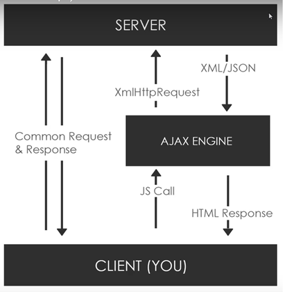

# Ajax Project

## Ajax Simple Flow

> [참고 Ajax Crash Course](https://www.youtube.com/watch?v=82hnvUYY6QA&list=PLillGF-RfqbbnEGy3ROiLWk7JMCuSyQtX&index=13&t=0s)

## Tutorials

-   [생활코딩 Ajax 강의](https://www.opentutorials.org/course/3281) 를 통한 실습
-   [fetch API](https://developer.mozilla.org/ko/docs/Web/API/Fetch_API)를 이용한 Ajax 구현
-   기본적인 SPA 개념을 구현
-   [WAMP](https://bitnami.com/stack/wamp/installer) 설치를 통한 Apache Web Server 구축
